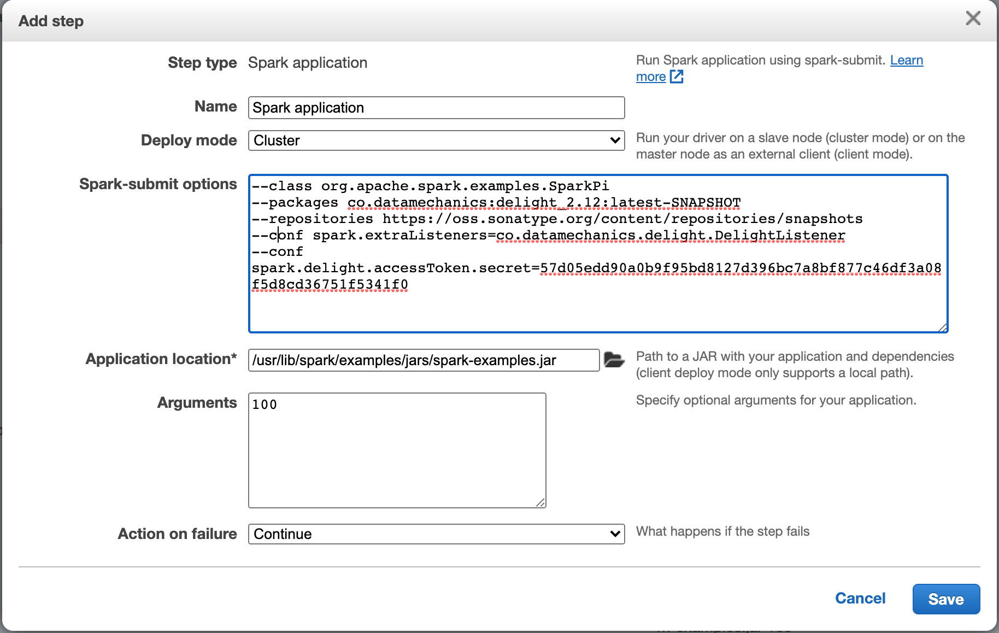

# Installation steps for AWS EMR

This document details instructions to install Delight on AWS EMR.

It assumes that you have created an account and generated an access token on the [Delight website](https://www.datamechanics.co/delight).

There are two ways (or "launch modes") to run a EMR spark cluster:

- the Step execution launch mode creates an ephemeral cluster to run operations on it,
- the Cluster launch mode creates a cluster that you can connect to to run Spark applications.

We detail instructions for both cases below.

## First option: Step execution launch mode

When creating a cluster in Step execution launch mode, AWS EMR lets you add a [Spark Step](https://docs.aws.amazon.com/emr/latest/ReleaseGuide/emr-spark-submit-step.html) to run a Spark application:


In the configuration window of the Spark step, add the following lines in the text box named `Spark-submit options`:

```java
--packages co.datamechanics:delight_<replace-with-your-scala-version-2.11-or-2.12>:latest-SNAPSHOT
--repositories https://oss.sonatype.org/content/repositories/snapshots
--conf spark.extraListeners=co.datamechanics.delight.DelightListener
--conf spark.delight.accessToken.secret=<replace-with-your-access-token>
```

Don't forget to replace the placeholders!
Latest Spark distributions on EMR use Scala version 2.12.



## Second option: Connect to the master node

Follow instructions to [connect to the master node over SSH](https://docs.aws.amazon.com/emr/latest/ManagementGuide/emr-connect-master-node.html).

Once connected, the `spark-submit` CLI will be available to you.
Please follow the [instructions to install Delight with the `spark-submit` CLI](spark_submit.md).

Latest Spark distributions on EMR use Scala version 2.12.
